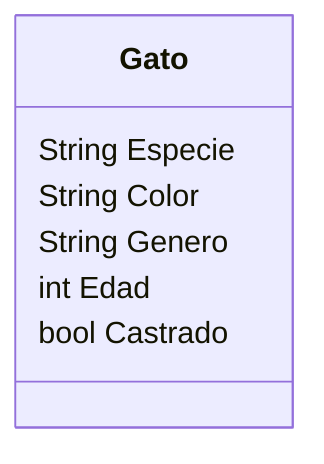

Un coleccionista de gatos los recolecta según sus
características. Las características que mas le importan
son el color, género, edad y si están castrados o no. 
El coleccionista registra los datos de cada gato 
que encuentra

Requisitos:
- Recolectar gatos
- Registrar los atributos de cada gato
- Todos los gatos son felinos

Objetos:
- Gato

Características:
- Gato
    - Especie
    - Color
    - Género
    - Edad
    - Castrado

Acciones:
- (No hay acciones)

