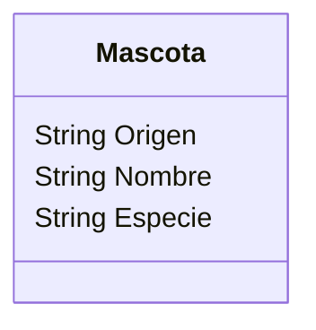

Un refugio de mascotas quiere registrar a los perros y gatos
que ingresan al refugio.
De cada mascota necesitan registrar el nombre, especie y origen.
Todas las mascotas tienen como origen "abandonado", este valor 
cambia a "rescatado" despues de un tiempo.

Requisitos:
- Registrar animales
- Registrar los atributos de cada animal
- Actualizar su origen después de registrarlos

Objetos:
- Mascota

Características:
- Mascota
    - Origen
    - Nombre
    - Especie

Acciones:
- (No hay acciones)

