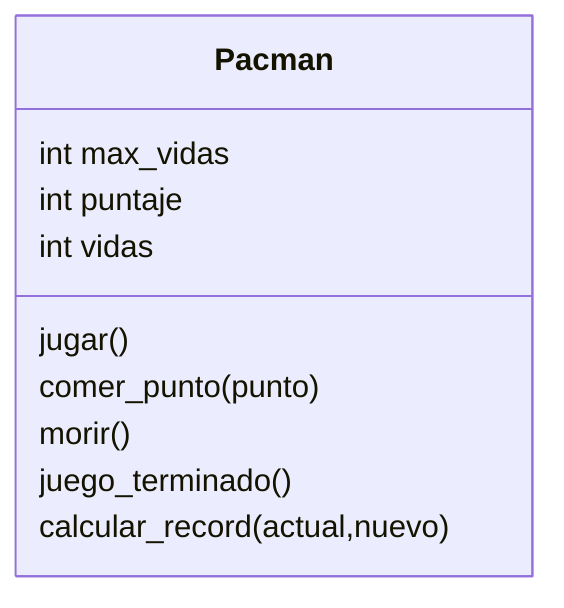

En el diseño de pacman el personaje puede comer puntos
Los puntos tienen un valor de 1 o 2, nace con máximo 2 vidas
Cuando pacman come un punto este suma su valor al puntaje
Cuando pacman muere pierde una vida pero no pierde el puntaje
Cuando pacman se queda sin vidas el juego se da por terminado
Si el juego terminó se puede calcula si hay un nuevo record

# Análisis
Requisitos:
- Crear un pacman
- Pacman tiene un puntaje
- Pacman tiene vidas
- Pacman inicia con máximo 2 vidas
- Pacman puede comerse los puntos
- Pacman suma el valor de los puntos
- Pacman pierde una vida cuando muere
- Pacman termina el juego cuando se queda sin vidas
- Pacman calcula si hay un nuevo record
Objetos:
- Pacman
Características:
- Pacman: `max_vidas`, `vidas`, `puntaje`
Acciones:
- Pacman:   `jugar`, `comer_punto`, `morir`,
            `juego_terminado`, `calcular_record`

