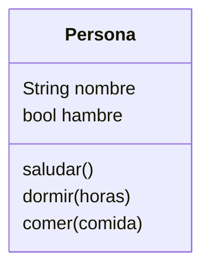
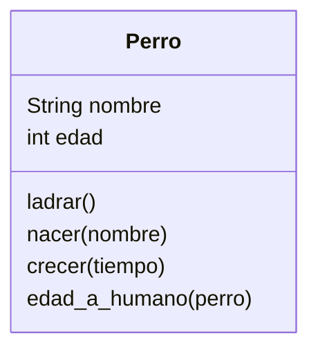
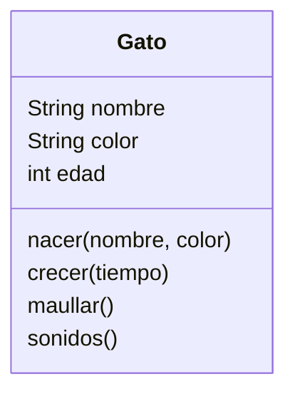

Crearemos un juego similar a Sims llamado `PyLife`
Las personas creadas tienen un nombre y
pueden saludar diciendo su nombre
Ahora las personas pueden dormir una cantidad de horas
En el juego ahora las personas pueden
tener hambre y comer para saciarla
Cuando duerme la persona despierta con hambre

# Análisis

Requisitos:
- Crear personas
- Las personas tienen un nombre
- Las personas pueden saludar
- Tiene un constructor que crea personas con nombre
- Las personas pueden dormir
- Las personas pueden comer
- Al despertar tienen hambre

Objetos:
- Persona

Características:
- Persona: Nombre, hambre

Acciones:
- Persona: Saludar, dormir, comer

En el juego `PyLife` diseñaremos ahora perros que pueden ladrar
Todos los perros tienen un nombre y empiezan como cachorros
La diferencia entre un perro y un humano en edad es de 7 años
y los perros pueden crecer con el tiempo

# Análisis
Requisitos:
- Crear un perro
- Los perros tienen un nombre
- Los perros pueden ladrar
- Los perros nacen como cachorros
- La edad de un perro es 7 veces menor que la de un humano

Objetos:
- Perro
Características:
- Perro: nombre, edad
Acciones:
- Perro: ladrar, nacer, crecer, edad_a_humano

En el juego `PyLife` diseñamos gatos que pueden maullar
Todos los gatos tienen un nombre y color, nacen como cachorros
los sonidos más comunes de los gatos son `miau` y `ronroneo`

# Análisis
Requisitos:
- Crear un gato
- Los gatos tienen un nombre y color
- Los gatos pueden maullar
- Los gatos nacen como cachorros
- Los gatos pueden hacer `miau` y `ronroneo`
- Los gatos pueden crecer con el tiempo

Objetos:
- Gato
Características:
- Gato: nombre, color, edad
Acciones:
- Gato: nacer, crecer, maullar, sonidos

