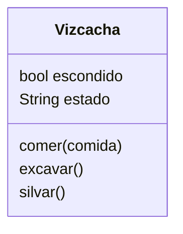

Creas un juego de rol donde eres una vizcacha
Puedes comer sólo zanahorias
Puedes excavar agujeros para esconderte cuando te asustas
Silvar `iiih iiih` te hace feliz

# Análisis
Requisitos:
- Crear una vizcacha
- Come sólo zanahorias
- Cuando excava un agujero se asusta
- Cuando excava un agujero se esconde
- Silvar `iiih iiih` le hace feliz

Objetos:
- Vizcacha

Características:
- Vizcacha: hambre, escondido, estado

Acciones:
- Vizcacha: Comer, excavar, silvar

