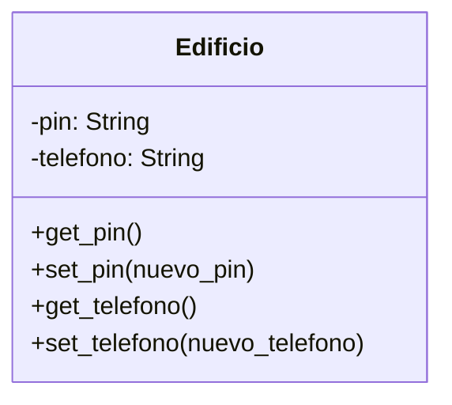

Un edificio necesita un sistema de control de acceso,
existe un pin de desbloqueo privado,
cualquier persona puede ver el pin de desbloqueo 
cualquier persona puede cambiar el pin
el pin de desbloqueo debe ser máximo 4 dígitos
el pin inicial será 1234

El edificio tendrá un número telefónico,
cualquiera puede ver el número telefónico
cualquiera puede cambiar el número telefónico
el número telefónico inicial será 123-456-7890

# Análisis
Requisitos:
- Un edificio necesita un sistema de control de acceso
- Existe un pin de desbloqueo privado
- Se puede ver el pin de desbloqueo mediante método público
- Se puede cambiar el pin de desbloqueo mediante método público
- El pin de desbloqueo debe ser máximo 4 dígitos
- El pin inicial será 1234
- El edificio tendrá un número telefónico
- Cualquiera puede ver el número telefónico 
- Cualquiera puede cambiar el número telefónico

Objetos:
- Edificio
Características:
- Edificio:
    - pin: String
    - telefono: String
Acciones:
- Edificio:
    - get_pin()
    - set_pin(nuevo_pin)
    - get_telefono()
    - set_telefono(nuevo_telefono)

