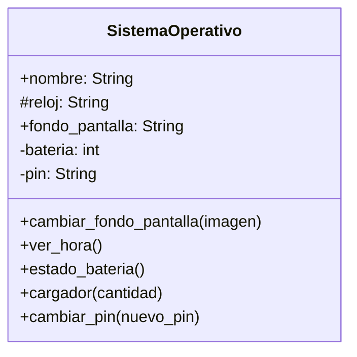

Un pequeño equipo de desarrolladores decidió crear
un sistema operativo para un celular,
inicialmente sólo tendrá un fondo de pantalla
Todos podemos ver y cambiar el fondo de pantalla,
el SO se llamará `PyPhoneOS`
tendrá un fondo inicial de `gatitos.jpg`

Vamos agregar un `reloj` al sistema operativo,
cualquiera puede ver la hora a través de un método `ver hora`,
también se puede observar la hora directamente,
mediante el atributo `reloj`

El sistema operativo tendrá una batería, 
sólo el sistema operativo cargará la batería,
mediante un método público podemos conocer
el porcentaje de batería y mediante otro
método público podremos cargar la batería,
de manera similar a un puerto de carga

El Sistema Operativo tendrá un pin de desbloqueo,
Se tiene que almacenar el pin,
sólo el sistema podrá cambiar el pin de desbloqueo,
y no se puede ver sólo se puede cambiar por
defecto el pin será 0000

# Análisis
Requisitos:
- Tiene un nombre
- Tiene un fondo de pantalla
- Cualquiera puede cambiar el fondo de pantalla
- Tiene un reloj
- Existe un método ver hora
- Tiene una batería
- Existe un método estado_batería
- Existe un método cargador para cargar la batería
- Tiene un pin de desbloqueo
- Sólo el sistema puede cambiar el pin de desbloqueo
- No se puede ver el pin de desbloqueo
Objetos:
- SistemaOperativo
Características:
- SistemaOperativo:
    - nombre: String
    - fondo_pantalla: String
    - reloj: String
    - bateria: int
    - pin: String
- SistemaOperativo:
    - cambiar_fondo_pantalla(imagen)
    - ver_hora()
    - estado_bateria()
    - cargador(cantidad)
    - cambiar_pin(nuevo_pin)

