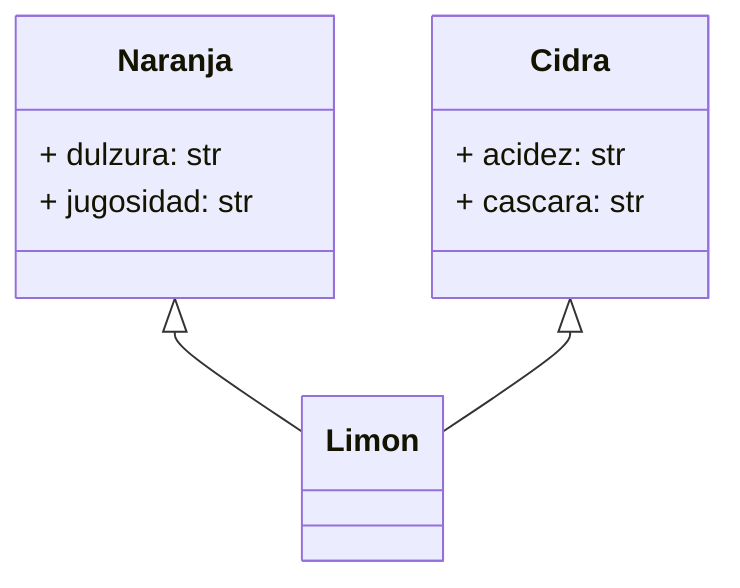

Un agrónomo quiere registrar frutas cítricas
La naranja y la cidra son frutas primarias
Pero el limón no es una fruta primaria
El limón es la mezcla de la cidra y la naranja amarga
La cidra aporta el sabor ácido y la dureza de la cáscara
La naranja amarga aporta el sabor dulce y la jugosidad

# Análisis
Requisitos:
- La naranja y la cidra son frutas cítricas primarias
- El limón no es una fruta primaria
- El limón es una mezcla de la cidra y la naranja amarga

Objetos:
- Naranja (Clase Padre)
- Cidra (Clase Padre)
- Limón (hereda de Naranja y Cidra)

Características:
- Cidra:
  - acidez: String
  - cascara: String
- Naranja:
  - dulzura: String
  - jugosidad: String

- Limon:
  - (sin características)

Acciones:
- Cidra:
  - (sin acciones)
- Naranja:
  - (sin acciones)
- Limón:
  - (sin acciones)

