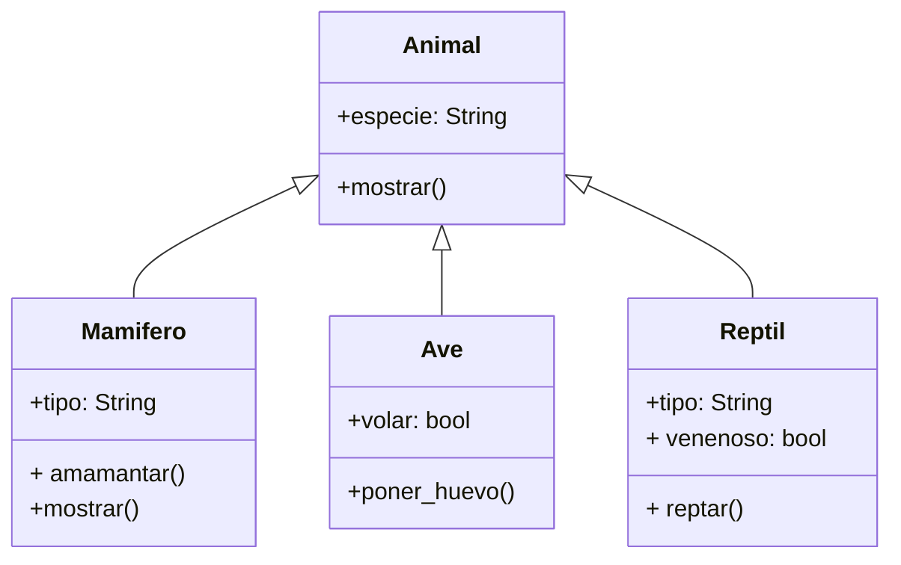

Un zoológico posee un catálogo digital de animales
Existen dos categorías principales: mamíferos y aves
Los animales tienen registrado la especie a la que pertenecen
Los mamíferos puede ser de dos tipos: terrestres o acuáticos
y puede amamantar a crías
Las aves tienen la característica de poder volar o no
y tienen la capacidad de poner huevos

En el zoológico se esta ampliando el catálogo
añadiendo una nueva categoría: reptiles
los reptiles pueden ser terrestres o acuáticos
pueden ser venenosos o no 
y tienen la capacidad de reptar

En el catálogo digital del zoológico
cada animales muestra su información
A través de un método propio `mostrar()`
Añade el método `mostrar()` a la clase Animal
y sobrescribe el método en la clase Mamífero
para mostrar más información de los mamíferos

Verifica si la instancia `caballo`
es de tipo `Mamifero`, `Animal` y `Ave`
Utiliza `isinstance()` para realizar las verificaciones
después de instanciar los objetos

Verifica si la clase `Mamifero`
es subclase de `Animal` y `Ave`
Utiliza `issubclass()` para realizar las verificaciones
después de instanciar los objetos

# Análisis
Requisitos:
- Registrar animales
- Almacenar información de especie
- Categorías principales mamíferos, aves y reptiles
- Los animales muestran su información
- Mamíferos son animales
- Mamíferos son terrestres o acuáticos
- Mamíferos pueden amamantar
- Mamíferos muestran su especie y tipo
- Aves son animales
- Aves pueden volar o no
- Aves pueden poner huevos
- Aves muestran su especie y si pueden volar
- Reptiles son animales
- Reptiles pueden ser terrestres o acuáticos
- Reptiles pueden ser venenosos o no
- Reptiles pueden reptar
- Reptiles muestran su especie, tipo y si son venenosos

Objetos:
- Animal (clase padre)
- Mamífero (clase hija)
- Ave (clase hija)
- Reptil (clase hija)

Características:
- Animal:
  - especie: String
- Mamífero:
  - tipo: String (terrestre, acuático)
- Ave:
  - volar: bool
- Reptil:
  - tipo: String (terrestre, acuático)
  - venenoso: bool

Acciones:
- Animal:
  - mostrar()
- Mamífero:
  - amamantar()
  - mostrar()
- Ave:
  - poner_huevo()
  - mostrar()
- Reptil:
  - reptar()
  - mostrar()

