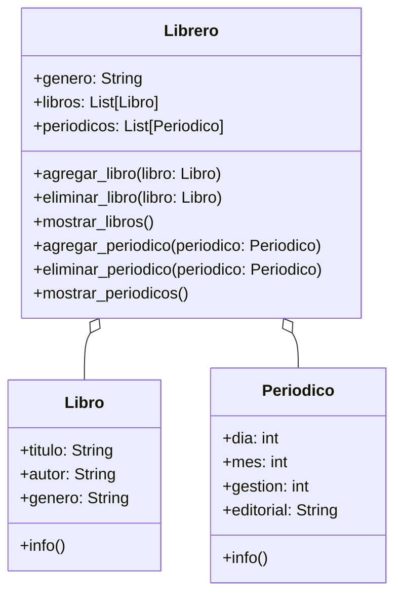

Una biblioteca guarda en un sistema el título, autor y género
de sus libros. Existen libreros digitales para organizar
Los libros están organizados por género, y se puede
agregar o eliminar libros de cada librero.
Se puede mostrar todos los libros de un librero
Actualmente existen 2 géneros: 
- Cocina
- Arte
Los libros de cada uno de estos géneros
son:
- Cocina
  - Cocina Criolla Boliviana, Daniel Figliuzzi
  - Gran libro cocina Boliviana, Jaime Cisneros
- Arte
  - Arte textil y mundo andino, Teresa Gisbert
  - Arte contemporáneo en Bolivia, Galería Altamira

El sistema bibliotecario ahora va almacenar en los libreros
periódicos de años pasados cada librero guarda periódicos 
de diferentes fechas de todas las editoriales.
Cada periódico guarda un día, mes, año y editorial
Se puede agregar o eliminar periódicos de cada librero
Se puede mostrar todos los periódicos de un librero

# Análisis
Requisitos:
- Guardar información de libros (título, autor, género)
- Organizar libros por género en libreros
- Mostrar libros de cada librero 
- Mostrar la información de un libro
- Periódicos tienen dia, mes, gestión y editorial
- Guardar periódicos en los libreros
- Mostrar la información de un periódico
- Mostrar periódicos de cada librero
Objetos:
- Libro
- Librero
- Periódico
Características:
- Libro:
    - título: String
    - autor: String
    - género: String
- Periódico:
    - dia: int
    - mes: int
    - gestión: int
    - editorial: String
- Librero:
  - género: String
  - libros: List[Libro]
  - periódicos: List[Periódico]
Acciones:
- Libro:
  - info()
- Periódico:
  - info()
- Librero:
  - agregar_libro(libro)
  - eliminar_libro(libro)
  - mostrar_libro()
  - agregar_periodico(periodico)
  - eliminar_periodico(periodico)
  - mostrar_periodicos()
