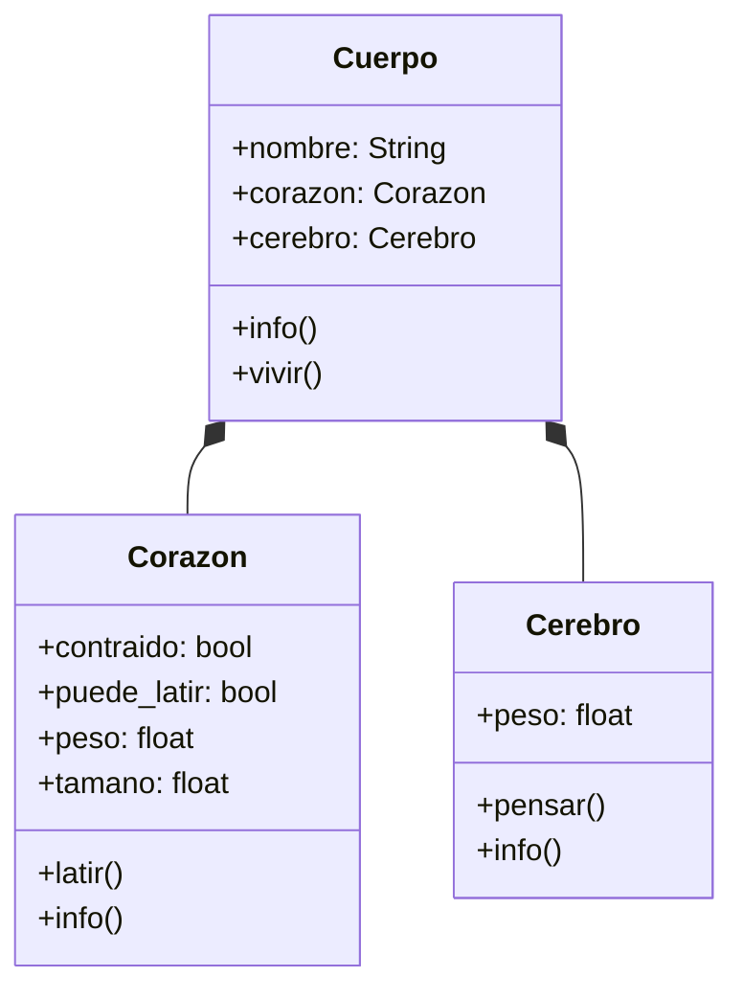

Un instituto de salud tiene una simulación del cuerpo humano
Cuenta con un corazón que posee un peso (kg) y tamaño (cm)
El corazón bombea sangre y funciona mediante
dos acciones: sístole y diástole
El cuerpo sólo posee un corazón, si puede latir
el cuerpo está vivo,
Si el corazón esta contraído hace díastole
Si el corazón está relajado hace sístole
Cada cuerpo tiene un nombre para identificarlo
Se puede mostrar la información del cuerpo y del corazón

Se va agregar a  la simulación del cuerpo humano el 
cerebro posee peso y cuenta con una acción: pensar
Es parte del cuerpo y no puede vivir sin él
El peso del cerebro es de 1.4 kg para todos los humanos
Mientras el corazón pueda latir el cerebro puede pensar
Se puede mostrar la información del cerebro

# Análisis
Requisitos:
- Guardar información del corazón (peso, tamaño)
- Guardar información del cuerpo (nombre, corazón)
- Cuando esta contraído hace diástole
- Cuando esta relajado hace sístole
- El cuerpo puede vivir si el corazón puede latir
- Guardar información del cerebro (peso)
- El cerebro piensa si el corazón puede latir
- Mostrar la información del cerebro
Objetos:
- Corazón
- Cuerpo
- Cerebro
Características:
- Corazón:
    - peso: float
    - tamaño: float
    - contraido: bool
    - puede_latir: bool
- Cuerpo:
    - nombre: String
    - corazón: Corazón
    - cerebro: Cerebro
- Cerebro:
    - peso: float
Acciones:
- Corazón:
    - latir()
    - info()
- Cuerpo:
    - info()
    - vivir()
- Cerebro:
    - pensar()
    - info()
