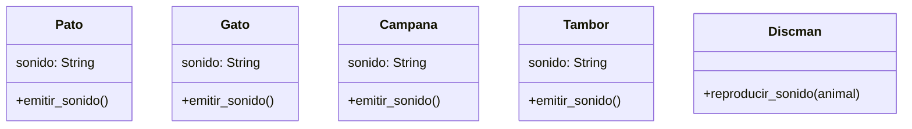

La empresa `PySound` desarrolla un Discman para niños
reproduce sonidos de animales y muestra el nombre del animal en
su pantalla. Actualmente tiene los siguientes animales:
- Pato 🦆 (Cuac, Cuac)
- Gato 🐱 (Miau, Miau)

La empresa `PySound` quiere mejorar su Discman para niños.
Le añaden la capacidad de reproducir sonidos
de objetos que no son animales,
añadiendo los siguientes instrumentos:
- Campana que hace "ding"
- Tambor que hace "boom"

# Analisis
Requisitos
- El Discman debe reproducir sonidos de animales
- Debe mostrar el animal que emite el sonido
- El pato debe emitir el sonido "cuac"
- El gato debe emitir el sonido "miau"
- Debe reproducir el sonido del pato
- Debe reproducir el sonido del gato

Objetos
- Pato
- Gato
- Discman

Características
- Pato:
    - sonido "cuac"
- Gato:
    - sonido "miau"

Acciones
- Pato: emitir sonido
- Gato: emitir sonido
- Discman: reproducir sonido

