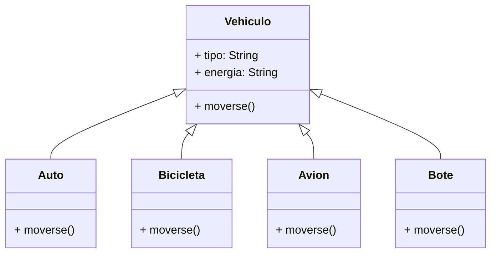

Una empresa de delívery `PyHL` controla diferentes
tipos de vehículos de manera remota para 
transportar paquetes, sus vehículos más comunes son:

🚗 Auto: terrestre, a gasolina, mueve a 200 km/h
🚲 Bicicleta: terrestre, a pedal, mueve a 20 km/h

Los vehículos pueden moverse de manera diferente

La empresa de delívery `PyHL` quiere ampliar su flota de vehículos
añadiendo nuevos tipos de transporte:

- ✈️ Avión: aéreo, a gasolina, mueve a 900 km/h
- ⛵ Bote: acuático, a viento, mueve a 30 km/h

Los vehículos pueden moverse de manera diferente

# Análisis
Requisitos
- Registrar los vehículos de la empresa
- Los autos pueden moverse mediante motor a gasolina
- Las bicicletas pueden moverse mediante pedales
- Los aviones pueden moverse mediante motor a gasolina
- Los botes pueden moverse mediante viento

Objetos
- Vehículo
    - Auto
    - Bicicleta
    - Avión
    - Bote

Características
- Vehículo: tipo, energia
- Auto: tipo, energia
- Bicicleta: tipo, energia
- Avión: tipo, energia
- Bote: tipo, energia

Acciones
- Vehículo: moverse
- Auto: moverse
- Bicicleta: moverse
- Avión: moverse
- Bote: moverse

