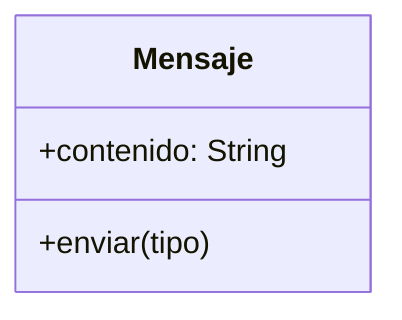

Una empresa de mensajería posee un sistema capaz de
enviar diferentes tipos de mensajes:
- Mensajes de texto
- Mensajes de audio
De acuerdo al tipo de mensaje, se debe enviar de manera diferente
Los mensajes de texto se envían como texto
Los mensajes de audio se envían como sonido
Un mensaje tiene un contenido

La empresa de mensajería quiere ampliar su sistema de mensajes
añadiendo la capacidad de enviar mensajes mediante video
Los mensajes de video deben enviarse como video 🎥

# Análisis
Requisitos
- Los mensajes tienen un contenido
- Existen dos tipos de mensajes: texto y audio
- Los mensajes de texto deben enviarse como texto
- Los mensajes de audio deben enviarse como sonido
- Los mensajes de video deben enviarse como video
  
Objetos
- Mensaje

Características
- Mensaje: contenido: String

Acciones
- Mensaje: enviar()

