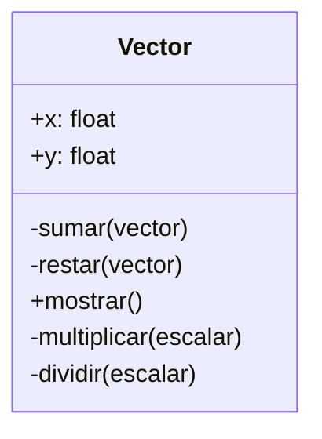

Un profesor de matemáticas quiere crear una calculadora
de vectores bidimensionales, los vectores tienen
dos componentes: x , y. Pueden sumarse y restarse
entre sí utilizando operadores + y -
Se muestran como pares (x, y) y tienen valores flotantes
La suma como la resta genera un nuevo vector resultante
Ejemplo:    A = (1, 1); B = (2, 3) 
            A + B = (3, 4) ; A - B = (-1, -2)

El profesor de matemáticas quiere ampliar la calculadora
de vectores bidimensionales, añadiendo la capacidad
de multiplicar y dividir vectores utilizando operadores * y /
Los vectores se puede multiplicar y dividirse
por un escalar (número) generando un nuevo vector resultante
Ejemplo:    (2, 4) * 2 = (4, 8)
            (2, 4) / 2 = (1, 2)

# Análisis
Requisitos
- Los vectores deben tener componentes x , y flotantes
- Los vectores pueden sumarse y restarse entre sí
- Los vectores se pueden mostrar como (x, y)
- La suma de vectores genera un nuevo vector
- La resta de vectores genera un nuevo vector
- Los vectores pueden sumarse con el operador `+`
- Los vectores pueden restarse con el operador `-`
- Los vectores pueden multiplicarse por un escalar
- Los vectores pueden dividirse por un escalar
- La multiplicación de vectores genera un nuevo vector
- La división de vectores genera un nuevo vector
- Los vectores pueden multiplicarse por el operador `*`
- Los vectores pueden dividirse por el operador `/`
Objetos
- Vector
Características
- Vector: x, y
Acciones
- Vector:   sumar, restar, mostrar, multiplicar, dividir

