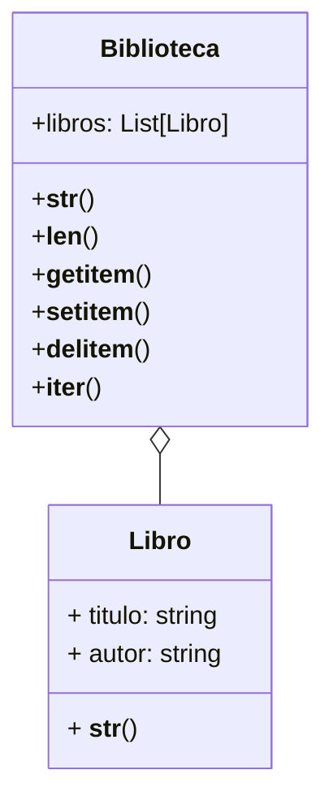

La biblioteca almacena una colección digital de libros
Quieren poder saber cuántos libros hay en la colección
De cada libro se guarda su título y autor.
- Ver los libros en formato `"[título] - [autor]"`.
- Ver la biblioteca en formato `"[libro1], [libro2], ..."`
- Los libros se almacenan en una lista dentro de la biblioteca
- La biblioteca debe permitir ver algunos libros por su índice
- La biblioteca debe permitir agregar nuevos libros
- La biblioteca debe permitir eliminar libros
- Se debe poder iterar sobre los libros de la biblioteca

# Análisis
Requisitos
- La biblioteca debe tener una colección de libros
- Cada libro debe tener un título y un autor
- La biblioteca debe poder saber cuántos libros hay
- Existe una relación de agregación entre Biblioteca y Libro
- El libro se representa como `"(título - autor)"`
- La biblioteca se representa como `"libro1, libro2, ..."`
- La biblioteca debe poder acceder a los libros por su índice
- La biblioteca debe poder agregar nuevos libros
- La biblioteca debe poder eliminar libros
- La biblioteca debe poder iterar sobre los libros
Objetos
- Biblioteca
- Libro
Características
- Biblioteca: colección de libros
- Libro: título, autor
Acciones
- Biblioteca: longitud, representación
- Biblioteca: acceso a libros por índice, agregar, eliminar, iterar
- Libro: representación

