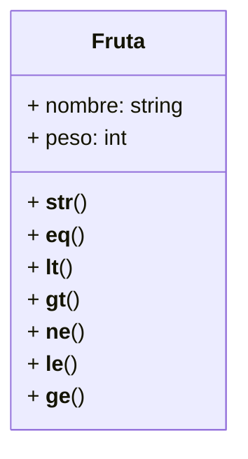

Un agrónomo tiene una herramienta para comparar frutas y
clasificarlas. Cada fruta tiene un nombre y un peso
Mediante el nombre y peso
- Quiere comparar si dos frutas son iguales
- Quiere comparar si dos frutas si una es menor que otra
- Quiere comparar si dos frutas si una es mayor que otra
- Se representa una fruta como `"[nombre] ➡ [peso] g"`
El peso de la fruta es un número entero que representa gramos

El agrónomo mediante el nombre y el peso de la fruta
quiere ampliar la comparación de frutas
- Quiere comparar si dos frutas son diferentes
- Quiere comparar si dos frutas son menores o iguales
- Quiere comparar si dos frutas son mayores o iguales

# Análisis
Requisitos
- Debe debe tener dos atributos: nombre y peso
- Debe poder representarse como "[nombre] ➡ [peso] g"
- Debe poder compararse con otra fruta
- Debe poder compararse para ver si son iguales
- Debe poder compararse para ver si es menor que otra fruta
  Mediante el peso y si ambas tienen el mismo nombre.
- Debe poder compararse para ver si es mayor que otra fruta
  Mediante el peso y si ambas tienen el mismo nombre.
- Debe poder compararse para ver si son desiguales
- Debe poder compararse para ver si es menor o igual que otra fruta
  Mediante el peso y si ambas tienen el mismo nombre.
- Debe poder compararse para ver si es mayor o igual que otra fruta
  Mediante el peso y si ambas tienen el mismo nombre.

Objetos
- Fruta
Características
- Fruta: nombre, peso
Acciones
- Fruta: igualdad, representación
- Fruta: menor que, mayor que, desigualdad
- Fruta: menor o igual que, mayor o igual que

