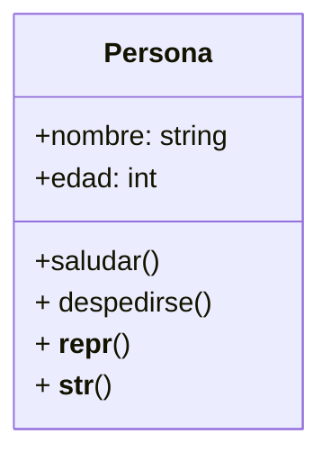

Existe la clase `Persona` que representa a una persona
con un nombre y una edad.
Cada que creamos una persona, queremos inicializar
sus atributos `nombre` y `edad` y posee la acción saludar

Tenemos la clase `Persona` que representa a una persona
con un nombre y una edad y queremos que al eliminar una persona
se despida con un mensaje y su nombre antes de ser destruida

Tenemos la clase `Persona` que representa a una persona
con un nombre y una edad.
La representación oficial del objeto debe mostrar
su nombre y edad de manera clara para poder recrear el objeto

La clase `Persona` que representa a una persona
con un nombre y una edad.
La representación en cadena del objeto debe mostrar el
 nombre y la edad de manera legible.
Con el formato `"[Nombre] ➡ [Edad] años"`

# Análisis
Requisitos
- Debe tener un constructor que reciba `nombre` y `edad`
- Debe almacenar estos valores en atributos de instancia
- Debe llamarse `Persona`
- La Persona debe poder saludar
- La Persona debe despedirse al ser destruida
- Debe tener una representación oficial del objeto
- Debe tener una representación en cadena del objeto

Objetos
- Persona

Características
- Persona: nombre, edad

Acciones
- Persona: saludar, despedirse, representación oficial, representación en cadena

