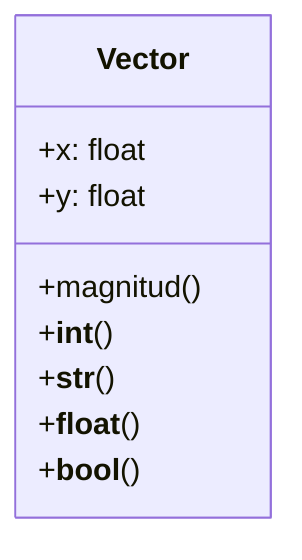

Un profesor de física tiene una calculadora de vectores
bidimensionales, los vectores tiene dos componentes x , y
la magnitud del vector es la suma de los componentes
absolutos de x , y.
Se representa visualmente con la forma `[x, y]`
Se convierte un vector a entero utilizando su magnitud
Los componentes son números flotantes

El profesor de física necesita que su calculadora de vectores
bidimensionales también pueda convertir vectores a flotantes
utilizando su magnitud

Para la calculadora de vectores bidimensionales
es importante poder evaluar si un vector es "verdadero" o "falso"
Se considera "verdadero" si su magnitud es mayor que cero
Se considera "falso" si su magnitud es igual a cero

# Análisis
Requisitos
- Debe tener un constructor que reciba x , y flotantes
- Debe almacenar estos valores en atributos de instancia
- Debe poder convertirse a entero utilizando su magnitud
- Debe poder calcular su magnitud
- Debe poder representarse visualmente como `[x, y]`
- Debe poder convertirse a flotante utilizando su magnitud
- Debe poder convertirse a booleano utilizando su magnitud
- Se considera "verdadero" si su magnitud es mayor que cero
Objetos
- Vector

Características
- Vector: x, y

Acciones
- Vector: magnitud, conversión a entero, representación
- Vector: conversión a flotante, conversión a booleano

