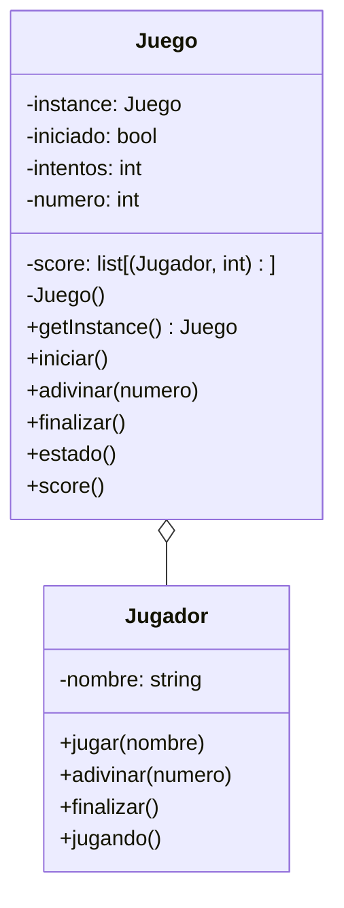

El juego "Adivina el número" permite a un jugador adivinar
un número secreto entre 1 y 100. El juego sólo permite un 
número a la vez y da pistas si el número es mayor o menor
que el número secreto.
Cada vez que un jugador adivina se guarda el jugador,
el número de intentos que le tomó adivinar y se muestra el score
El juego termina cuando el jugador escribe "salir"
Cada jugador posee un nombre

# Analisis
Requisitos:
- El juego debe seleccionar un número secreto 
  al azar entre 1 y 100
- El jugador debe adivinar el número secreto
- El juego debe informar si el número es mayor o
  menor que el número secreto
- El juego registra un Score con el jugador y el 
  número de intentos
- El juego termina cuando el jugador escribe "salir"

Objetos:
- Juego: Representa el juego en sí
- Jugador: Representa al jugador que adivina el número

Características:
- Juego: numero, score
- Jugador: nombre

Acciones:
- Juego: iniciar, adivinar, score
- Juego: estado, finalizar
- Jugador: jugar, adivinar
- Jugador: finalizar, jugando

