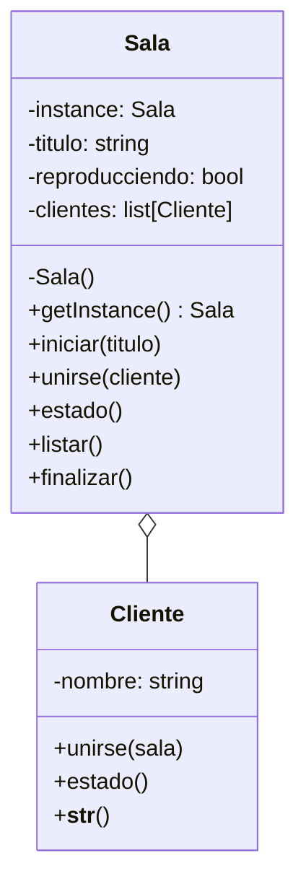

Una empresa de cine desea llevar el cine a casa de sus clientes,
para ello creó un sistema donde los clientes pueden unirse 
a una sala de cine virtual y ver películas juntos.
Todos los clientes ven la misma película
Si un cliente se une, se adiciona a la misma sala de
cine virtual y continua viendo la película desde donde está
Los clientes tienen un nombre y la película tiene un título
y un estado de reproducción (en reproducción o detenida)
Puedes ver cuantas personas hay en la sala y el título
Al iniciar se debe ingresar el título de la película e iniciará
reproducción, después irán ingresando clientes dando su nombre
Cada cliente puede saber el estado y título de la película
Tiene que tener un menú donde: 

1. Iniciar película
2. Unirse a sala
3. Ver estado
4. Ver clientes
5. Finalizar película
6. Salir

# Análisis
Requisitos
- Los clientes pueden unirse a una sala de cine virtual
- Los clientes pueden ver una película juntos
- Los clientes pueden ver el estado de la película
- Los clientes pueden ver cuantas personas hay en la sala
- Los clientes pueden ver el título de la película
- La película puede ser iniciada y finalizada
- El sistema debe tener un menú para interactuar
- La película tiene un título y un estado de reproducción
- Los clientes tienen un nombre
- La sala de cine es única
- La sala tiene una lista de clientes
Objetos
- Sala: Representa la sala de cine virtual
- Cliente: Representa al cliente que se une a la sala
Características
- Sala: titulo, reproducciendo, clientes
- Cliente: nombre
Acciones
- Sala: iniciar, unirse, estado, listar
- Cliente: unirse, estado

