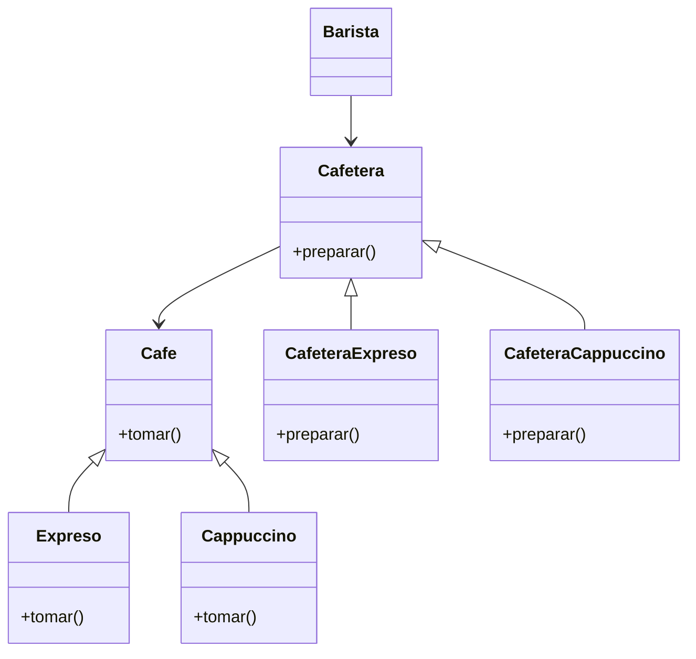

Una cafetería prepara Expresos y Cappuccinos,
el cliente (tú) solo debes pedir el tipo de café que desea
el barista utilizará las máquinas adecuadas para preparar el café
Todos los cafes se pueden tomar
Las cafeteras preparan un tipo de café, después son consumidos
por el cliente
Al ingresar salir se termina la ejecución

# Análisis

Requisitos:
- Se preparan dos tipos de café: Expreso y Cappuccino
- El cliente solo debe pedir el tipo de café que desea
- Se utiliza la máquina adecuada para cada café
- Todos los cafés se pueden tomar
- Las cafeteras preparan un tipo de café
- Si se ingresa "salir" se termina la ejecución

Objetos:
- Café (Expreso, Cappuccino)
- Cafetera (CafeteraExpreso, CafeteraCappuccino)
- Barista

Características:
- Café: (sin características)
- Expreso: (Café)
- Cappuccino: (Café)
- Cafetera: (sin características)
- CafeteraExpreso: (Cafetera)
- CafeteraCappuccino: (Cafetera)
- Barista: (sin características)

Acciones:
- Café: tomar
- Expreso: tomar
- Cappuccino: tomar
- Cafetera: preparar
- CafeteraExpreso: preparar
- CafeteraCappuccino: preparar
- Barista: preparar cafe

