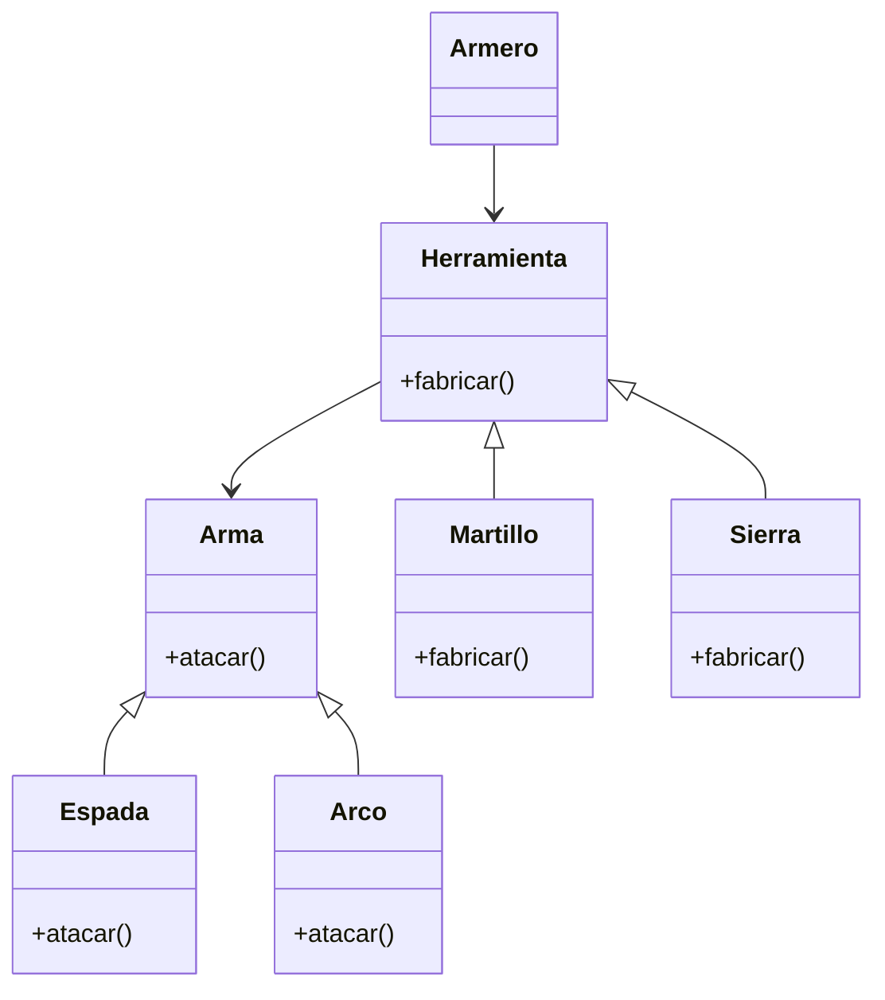

En un juego de rol, los jugadores pueden elegir diferentes
tipos de armas.
Cuando un jugador solicita un arma, el armero utiliza
la herramienta adecuada para crearla
Cada herramienta crea un solo tipo de arma:
- El martillo crea espadas
- La Sierra crea arcos
Todas las armas pueden usarse para atacar
Si el jugador escribe "salir" en lugar de un tipo de arma,
el programa finaliza.

# Analisis
Requisitos:
- Hay dos tipos de armas: Espada y Arco.
- El jugador solo debe pedir el tipo de arma que desea.
- Se usa la herramienta adecuada para fabricar cada arma.
- Todas las armas pueden usarse para atacar.
- Cada herramienta fabrica un tipo de arma.
- Si se ingresa "salir" se termina la ejecución.

Objetos:
- Arma (Espada, Arco)
- Herramienta (Martillo, Sierra)
- Armero

Características:
- Arma: (sin características extra)
- Espada: (Arma)
- Arco: (Arma)
- Herramienta: (sin características)
- Martillo: (Herramienta)
- Sierra: (Herramienta)
- Armero: (sin características)

Acciones:
- Arma: atacar()
- Espada: atacar()
- Arco: atacar()
- Herramienta: fabricar()
- Martillo: fabricar()
- Sierra: fabricar()
- Armero: fabricar arma

